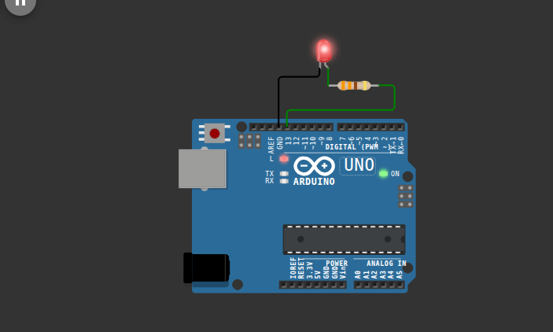

# Activity 1 - Simple Blink

This is a simple program that blinks the LED on pin 13 on and off.

## OBJECTIVE(s)

- Learn how to blink an LED on and off using `digitalWrite`
- Learn how to use `delay`

## SCREENSHOTS

## VIDS

