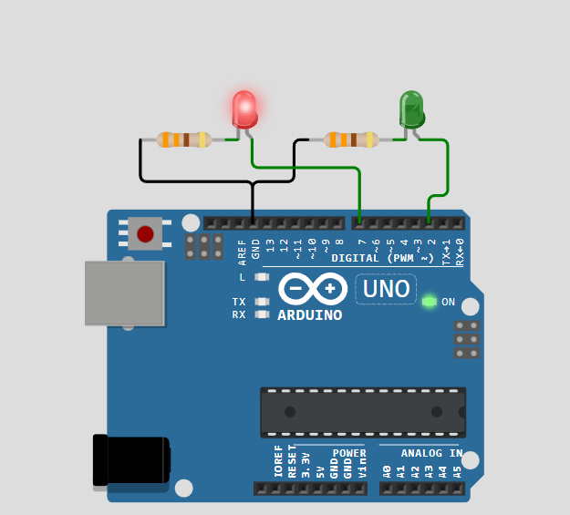

# Activity 2 - Blink LED with no Delay Function

In this activity, we will learn how to program our aruduino to blink two LEDs on and off without using the 'delay' function.

## OBJECTIVE(s)

- Learn how to blink an LED on and off using `digitalWrite`
- Learn how to use `millis()`

## SCREENSHOTS

