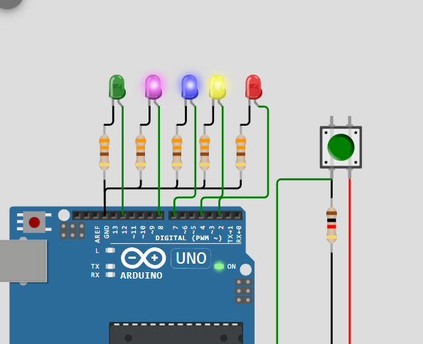

# Activity 3 - LED Chaser / Knight Rider

In this activity, we will use a button to control the LED chaser. When the button is pressed, the LED chaser will start to move in a specific pattern. But when the button is press again, the LED chaser will stop moving.

## OBJECTIVE

- Learn how to use a button to control the LED chaser.
- Learn how to use a variable to track the state of the button.
- Learn how to use a variable to track the position of the LED chaser.
- Learn how to use a variable to track the state of the LED chaser.

## SCREENSHOTS

## NOTES

If you want to try this simulation on the internet, you can copy the source code from [here](../Activity_3-LED-Chaser/src/Activity-3-LED-Chaser.ino) and paste it into the [Try It Yourself](https://wokwi.com/) section of the website.
