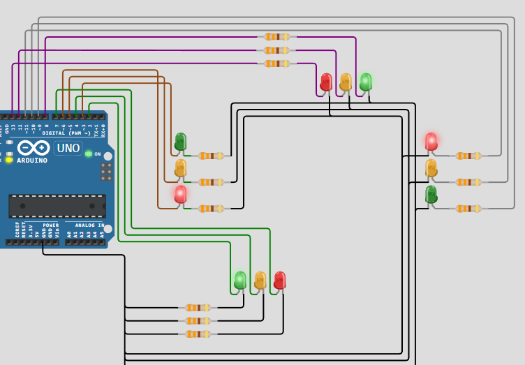

# Activity 4 - Traffic Light System

In this activity, we will be creating a traffic light system using an Arduino Uno board. We will use LEDs to simulate the traffic lights and control their behavior using a timer millis function.

## OBJECTIVE(s)

- Create a traffic light system using an Arduino Uno board.
- Use LEDs to simulate the traffic lights.
- Control the behavior of the traffic lights using a timer millis function.
- Use a variable to track the state of the traffic lights.

## SCREENSHOTS

## NOTES

If you want to try this simulation on the internet, you can copy the source code from [here](../Activity_4-Traffic-Light-System/src/Activity-4-Traffic-Light-System.ino) and paste it into [this Website](https://wokwi.com/) section of the website.
