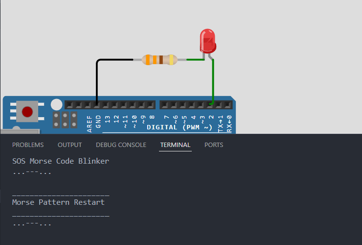

# Activity 5 - SOS Morse Code Blinker

In this activity, you will use the SOS Morse code to create a blinking SOS signal. We will still be using a timer millis function to control the blinking pattern. This time, we will also use a variable to track the state of the SOS signal.

## OBJECTIVE(s)

- Use the SOS Morse code to create a blinking SOS signal.
- Use a timer millis function to control the blinking pattern.
- Use a variable to track the state of the SOS signal.

## SCREENSHOTS

## NOTES

If you want to try this simulation on the internet, you can copy the source code from [here](../Activity_5-SOS-Morse-Code-Blinker/src/Activity-5-SOS-Morse-Code-Blinker.ino) and paste it into [this Website](https://wokwi.com/) section of the website.
