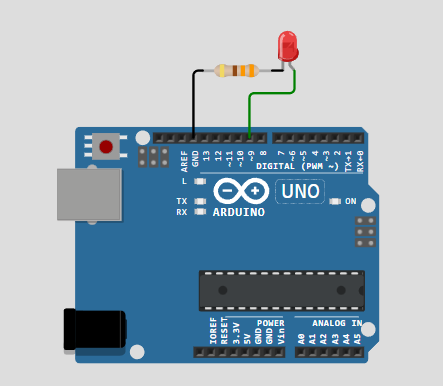

# Activity 6 - LED Brightness Control

This activity will allow us to control the brightness using only the code inside the program. We used millis function to get the time and manipulate our blinking red led with the brightness control using if logical statements.

## OBJECTIVE(s)

- Learn how to manipulate the brightness on an LED using `analogWrite`
- Learn how to use `millis()`
- Learn how to use if logical statements
- Learn how to use nested if statements

## SCREENSHOTS

## Notes

- The brightness control will be done using if logical statements and nested if statements.
- If the brightness is 0, the LED will be off.
- IF the brightness reaches 255, the LED will be brighter.
- If you want to try this simulation on the internet, you can copy the source code from [here](../Activity_6-LED-Brightness-Control/src/Activity-6-LED-Brightness-Control.ino) and paste it into [this Website](https://wokwi.com/) section of the website.
