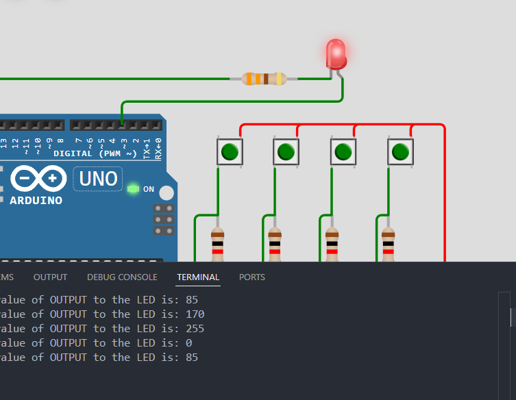

# Activity 7-LED-With-Button-Control

This activity shows how to control an LED using a multiple push button. We have used the three push button to control how bright the LED will be and there is a reset button to turn off the LED.

## OBJECTIVE(s)

- Use the three push button to control the brightness of the LED
- Use the reset button to turn off the LED
- Use millis function to control the brightness of the LED

## SCREENSHOTS

## NOTES

- This is not really a recommended approach to control the brightness of the LED. However, this is a simple program that shows how to use the three push button to control the brightness of the LED and the reset button to turn off the LED.
- The brightness control will be done using if logical statements and nested if statements.
- If you want to simulate this circuit on the internet, click [here](../Activity_7-LED-With-Button-Control/src/Activity-7-LED-With-Button-Control.ino) to copy the source code and paste it into [this Website](https://wokwi.com/) section of the website.
