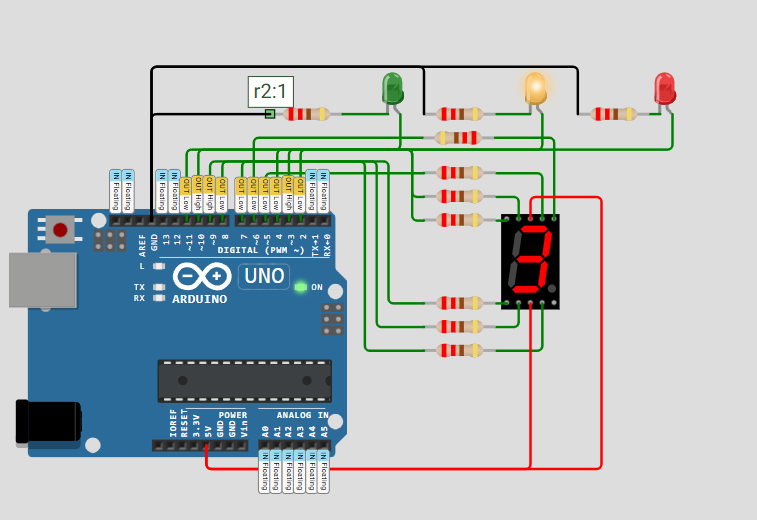

# Activity 8 - Traffic Light with Segment

This activity will demonstrate how to use a traffic light with 7 segment display. We will use a timer millis function to control the traffic light and display the current state on the 7 segment display.

## OBJECTIVE(s)

- Use millis function to control the traffic light and display the current state on the 7 segment display
- Use a variable to track the state of the traffic light
- Use a 7 segment display to display the current state of the traffic light
- Ensure the traffic light and 7 segment display are synchronized

## SCREENSHOTS

## NOTES

- If you want to simulate this circuit on the internet, click [here](../Activity_8-Traffic-Light-with-Segment/src/Activity-8-Traffic-Light-with-Segment.ino) to copy the source code and paste it into [this Website](https://wokwi.com/) section of the website.
